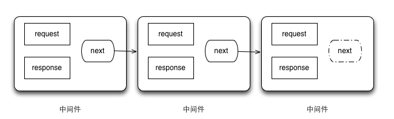

# 1.了解Connect中间件的工作机制
在中间件的上下文中，有着三个变量。分别代表请求对象、响应对象、以及一个名为next的回调函数。一个中间件完成自己的工作，要执行后续的中间件时，可以调用这个回调函数。
```
function (req, res, next) {
  // 中间件
}
```
# 2.组合中间件
- connect中的use方法用来组合中间件  
    
```
const connect = require('connect');
function logger(req,res,next){
    console.log('%s %s',req.method,req.url);
    next();
}
function hello(req,res){
    res.setHeader('Content-Type','text/plain');
    res.end('hello world');
}
connect()
  .use(logger)
  .use(hello)
  .listen(3000);
```
- 中间的顺序会对程序的行为造成影响  
```
const connect = require('connect');
function logger(req,res,next){
    console.log('%s %s',req.method,req.url);
    next();
}
function hello(req,res){
    res.setHeader('Content-Type','text/plain');
    res.end('hello world');
}
connect()
  .use(hello)
  .use(logger)
  .listen(3000);

//因为hello不会调用next()，所以logger永远不会被调用
```
**如果某个中间件不调用next(),那链在它后面的中间件就不会被调用**
# 3.创建可配置的中间件
为了做到可配置，中间件一般会遵循一个简单的惯例：**用一个函数返回另一个函数（闭包）**。
```
function setup(options){
    //设置逻辑
    return function(req,res,next){
        //中间件逻辑
    }
}

//用法
app.use(setup({some:'options'}))
```
# 4.使用错误处理中间件
错误处理中间件函数必须有四个参数：err,req,res和next
```
const env = process.env.NODE_ENV || 'development';

function errorHandler(err,req,res,next){
    res.statusCode = 500;
    switch(env){
        case 'development':
          console.error('Error:');
          console.error(err);
          res.setHeader('Content-Type','application/json');
          res.end(JSON.stringify(err));
          break;
        default:
          res.end('Server error');
    }
}

module.exports = errorHandler;
```
**当Connect遇到错误时，它会切换，只去调用错误处理中间件**