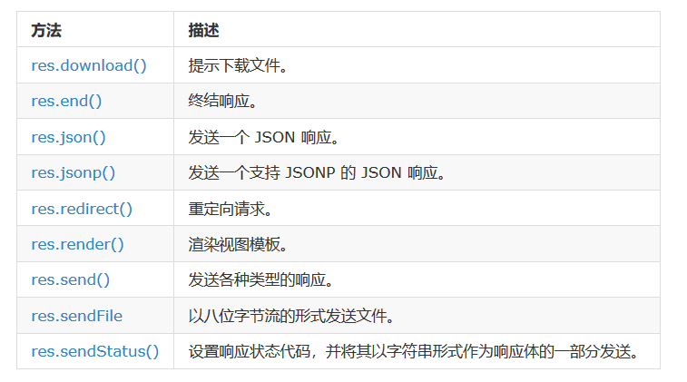

# 路由
路由是指如何定义应用的端点（URIs）以及如何响应客户端的请求。  
路由是由一个 URI、HTTP 请求（GET、POST等）和若干个句柄组成，它的结构如下： app.METHOD(path, [callback...], callback)， app 是 express 对象的一个实例， METHOD 是一个 HTTP 请求方法， path 是服务器上的路径， callback 是当路由匹配时要执行的函数。
```
var express = require('express');
var app = express();

// 当主页收到 GET 请求时，返回 "hello world"。
app.get('/', function(req, res) {
  res.send('hello world');
});
```
# 路由方法
Express 定义了如下和 HTTP 请求对应的路由方法： get、post、put、head、delete、options、trace、copy、lock、mkcol、move、purge、propfind、proppatch、unlock、report、mkactivity、checkout、merge、m-search、notify、subscribe、unsubscribe、patch、search 和 connect。  
app.all() 是一个特殊的路由方法，没有任何 HTTP 方法与其对应，它的作用是对于一个路径上的所有请求加载中间件。  
在下面的例子中，来自 "/secret" 的请求，不管使用 GET、POST、PUT、DELETE 或其他任何 http 模块支持的 HTTP 请求，句柄都会得到执行。
```
app.all('/secret', function (req, res, next) {
  console.log('Accessing the secret section ...');
  next(); // 交给下一个句柄处理
});
```
# 路由路径
路由路径和请求方法一起定义了请求的端点，它可以是字符串、字符串模式或者正则表达式。
```
// 匹配根路径的请求
app.get('/', function (req, res) {
  res.send('root');
});

// 匹配 /about 路径的请求
app.get('/about', function (req, res) {
  res.send('about');
});

// 匹配 /random.text 路径的请求
app.get('/random.text', function (req, res) {
  res.send('random.text');
});

// 匹配 acd 和 abcd
app.get('/ab?cd', function(req, res) {
  res.send('ab?cd');
});

// 匹配 abcd、abbcd、abbbcd等
app.get('/ab+cd', function(req, res) {
  res.send('ab+cd');
});

// 匹配 abcd、abxcd、abRABDOMcd、ab123cd等
app.get('/ab*cd', function(req, res) {
  res.send('ab*cd');
});

// 匹配 /abe 和 /abcde
app.get('/ab(cd)?e', function(req, res) {
 res.send('ab(cd)?e');
});

// 匹配任何路径中含有 a 的路径：
app.get(/a/, function(req, res) {
  res.send('/a/');
});

// 匹配 butterfly、dragonfly，不匹配 butterflyman、dragonfly man等
app.get(/.*fly$/, function(req, res) {
  res.send('/.*fly$/');
});
```
# 路由句柄
可以为请求处理提供多个回调函数，其行为类似 中间件。唯一的区别是这些回调函数有可能调用 next('route') 方法而略过其他路由回调函数。可以利用该机制为路由定义前提条件，如果在现有路径上继续执行没有意义，则可将控制权交给剩下的路径。
- 使用一个回调函数处理路由：
```
app.get('/example/a', function (req, res) {
  res.send('Hello from A!');
});
```
- 使用多个回调函数处理路由（记得指定 next 对象）：
```
app.get('/example/b', function (req, res, next) {
  console.log('response will be sent by the next function ...');
  next();
}, function (req, res) {
  res.send('Hello from B!');
});
```
- 使用回调函数数组处理路由：
```
var cb0 = function (req, res, next) {
  console.log('CB0');
  next();
}

var cb1 = function (req, res, next) {
  console.log('CB1');
  next();
}

var cb2 = function (req, res) {
  res.send('Hello from C!');
}

app.get('/example/c', [cb0, cb1, cb2]);
```
- 混合使用函数和函数数组处理路由：
```
var cb0 = function (req, res, next) {
  console.log('CB0');
  next();
}

var cb1 = function (req, res, next) {
  console.log('CB1');
  next();
}

app.get('/example/d', [cb0, cb1], function (req, res, next) {
  console.log('response will be sent by the next function ...');
  next();
}, function (req, res) {
  res.send('Hello from D!');
});
```
# 响应方法
下表中响应对象（res）的方法向客户端返回响应，终结请求响应的循环。如果在路由句柄中一个方法也不调用，来自客户端的请求会一直挂起。  

# app.route()
可使用 app.route() 创建路由路径的链式路由句柄。由于路径在一个地方指定，这样做有助于创建模块化的路由，而且减少了代码冗余和拼写错误。
```
app.route('/book')
  .get(function(req, res) {
    res.send('Get a random book');
  })
  .post(function(req, res) {
    res.send('Add a book');
  })
  .put(function(req, res) {
    res.send('Update the book');
  });
```
# express.Router
可使用 express.Router 类创建模块化、可挂载的路由句柄。Router 实例是一个完整的中间件和路由系统，因此常称其为一个 "mini-app"。  
在 app 目录下创建名为 birds.js 的文件，内容如下：
```
var express = require('express');
var router = express.Router();

// 该路由使用的中间件
router.use(function timeLog(req, res, next) {
  console.log('Time: ', Date.now());
  next();
});
// 定义主页路由
router.get('/', function(req, res) {
  res.send('Birds home page');
});
// 定义 about 路由
router.get('/about', function(req, res) {
  res.send('About birds');
});

module.exports = router;
```
然后在应用中加载路由模块：
```
var birds = require('./birds');
...
app.use('/birds', birds);
```
应用即可处理发自 /birds 和 /birds/about 的请求，并且调用为该路由指定的 timeLog 中间件。