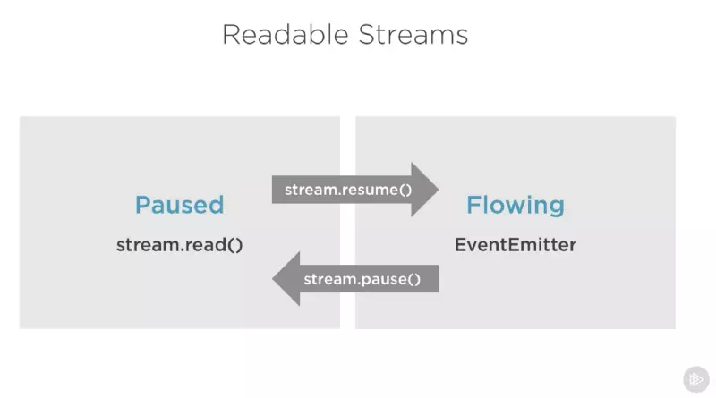

# stream（流）
流（stream）是 Node.js 中处理流式数据的抽象接口。 stream 模块用于构建实现了流接口的对象。

Node.js 提供了多种流对象。 例如，HTTP 服务器的请求和 process.stdout 都是流的实例。
```
const stream = require('stream');

```
# 1.流的类型
- writable-可写入数据的流(例如：fs.createWriteStream())
- Readable-可读取数据的流(例如：fs.createReadStream())
- Duplex-可读可写的流(例如：net.Socket)
- Transform-在读写过程中可以修改或转换数据的Duplex流(例如：zlib.createDeflate())
## 1.1可写流
```
const fs = require('fs');
const file = fs.createWriteStream('./big.file');

for(let i=0; i<= 1e6; i++) {
  file.write('Lorem ipsum dolor sit amet, consectetur adipisicing elit, sed do eiusmod tempor incididunt ut labore et dolore magna aliqua. Ut enim ad minim veniam, quis nostrud exercitation ullamco laboris nisi ut aliquip ex ea commodo consequat. Duis aute irure dolor in reprehenderit in voluptate velit esse cillum dolore eu fugiat nulla pariatur. Excepteur sint occaecat cupidatat non proident, sunt in culpa qui officia deserunt mollit anim id est laborum.\n');
}

file.end();
```
### 事件
- drain事件，这是一个表示可写流可以接收更多的数据的信号
```
// 向可写流中写入数据一百万次。
// 留意背压（back-pressure）。
function writeOneMillionTimes(writer, data, encoding, callback) {
  let i = 1000000;
  write();
  function write() {
    let ok = true;
    do {
      i--;
      if (i === 0) {
        // 最后一次写入。
        writer.write(data, encoding, callback);
      } else {
        // 检查是否可以继续写入。 
        // 不要传入回调，因为写入还没有结束。
        ok = writer.write(data, encoding);
      }
    } while (i > 0 && ok);
    if (i > 0) {
      // 被提前中止。
      // 当触发 'drain' 事件时继续写入。
      writer.once('drain', write);
    }
  }
}

```
- finish事件，当所有数据都被写入到底层系统后会触发此事件
```
const writer = getWritableStreamSomehow();
for (let i = 0; i < 100; i++) {
  writer.write(`写入 #${i}!\n`);
}
writer.end('写入结尾\n');
writer.on('finish', () => {
  console.error('写入已完成');
});

```
## 1.2 可读流
Node fs 模块中的 createReadStream 方法可以针对任何文件给我们返回一个可读流。我们可以把它和响应对象连接起来：
```
const fs = require('fs');
const server = require('http').createServer();

server.on('request', (req, res) => {
  const src = fs.createReadStream('./big.file');
  src.pipe(res);
});

server.listen(8000);
```
### 事件
- data事件，任何时候当可读流发送数据给它的消费者时，会触发此事件
    - chunk \<Buffer> | \<string> | \<any> 数据块。 对于非对象模式的流， chunk 可以是字符串或 Buffer。 对于对象模式的流， chunk 可以是任何 JavaScript 值，除了 null。
```
const readable = getReadableStreamSomehow();
readable.on('data', (chunk) => {
  console.log(`接收到 ${chunk.length} 个字节的数据`);
});

```
- end事件，当可读流没有更多的数据要发送给消费者时，会触发此事件
```
const readable = getReadableStreamSomehow();
readable.on('data', (chunk) => {
  console.log(`接收到 ${chunk.length} 个字节的数据`);
});
readable.on('end', () => {
  console.log('已没有数据');
});

```
### 两种读取模式
- 流动模式（flowing），数据自动从底层系统读取，并通过 EventEmitter 接口的事件尽可能快地被提供给应用程序。
- 暂停模式（paused），必须显式调用 stream.read() 读取数据块。  


  

所有可读流都开始于暂停模式，可以通过以下方式切换到流动模式：

- 添加 'data' 事件句柄。
- 调用 stream.resume()。
- 调用 stream.pipe()。  

可读流可以通过以下方式切换回暂停模式：

- 如果没有管道目标，则调用 stream.pause()。
- 如果有管道目标，则移除所有管道目标。调用 stream.unpipe() 可以移除多个管道目标。  

## 1.3 pipe方法
- 不断从来源可读流中获得一个指定长度的数据。
- 将获取到的数据写入目标可写流。
- 平衡读取和写入速度，防止读取速度大大超过写入速度时，出现大量滞留数据。
```
'use strict'
import {createReadStream, createWriteStream} from 'fs'

createReadStream('/path/to/a/big/file').pipe(createWriteStream('/path/to/the/dest'))
```
